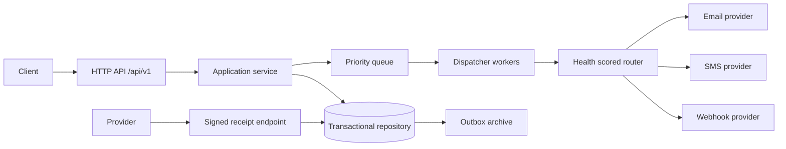
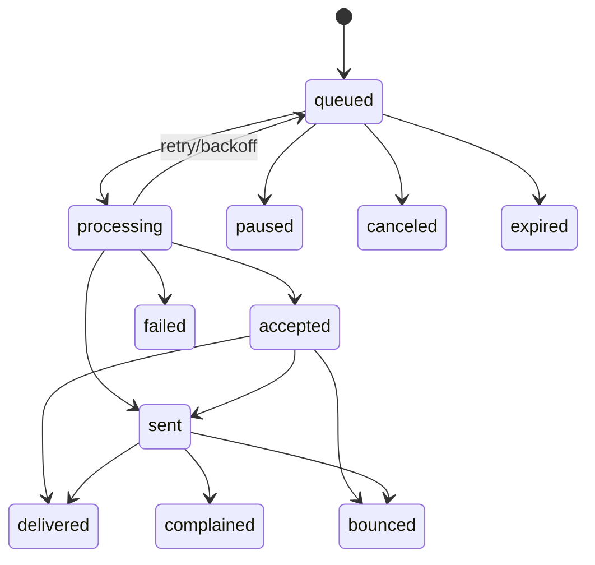
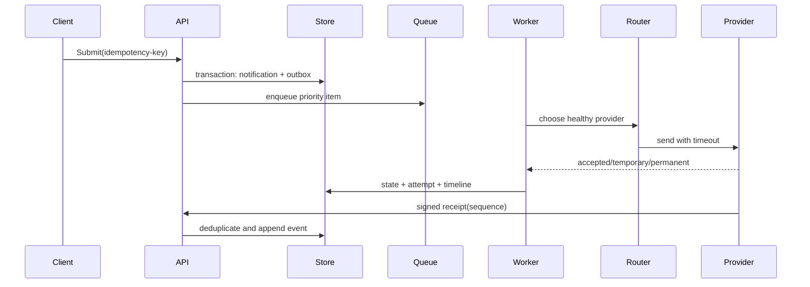

# Multichannel Notification Platform

一个纯 Go 1.23 的多租户事务通知投递平台，覆盖 Email、SMS、Webhook 和 Push。项目聚焦可靠投递、供应商故障切换、延迟/优先级队列、租户配额、模板版本和验签回执，不包含 IM、营销报表、CRM 或订单流程。

## Quick start

```bash
go test ./...
go vet ./...
go run ./cmd/notification-api
curl -X POST localhost:8080/api/v1/notifications -H 'Content-Type: application/json' -H 'X-Tenant-ID: acme' \
  -d '{"idempotency_key":"invoice-100","channel":"email","targets":[{"address":"user@example.com"}],"subject":"Invoice","body":"ready","priority":80}'
```

The default store is `data/store.json`; set `NOTIFY_DATA_FILE` for another location. A development mock provider is intentionally compiled into local mode. Production deployments must replace it with a provider adapter and Secret references. Configuration is YAML-like key/value plus environment overrides; secrets are never written to the JSON store.

## Architecture



Domain code is independent of transport and storage. The repository uses atomic temporary-file replacement for the local development profile and exposes interfaces that can be backed by PostgreSQL/object storage in production. Every notification has an idempotency key scoped to a tenant, a monotonic version used as an ETag, and an append-only timeline.

## Domain and state machine

`Notification` contains tenant, channel, normalized targets, template/body, trigger, expiry, priority and business ID. `Attempt` captures provider result and retry classification. `TimelineEvent` records accepted, sent, delivered, bounced, complained, failed or expired transitions.



### Delivery sequence



## API examples

Endpoints are documented in `api/openapi/openapi.yaml` and include:

- `POST /api/v1/notifications`, `POST /notifications/batch` equivalent single-request primitive, `GET /notifications/{id}`, `GET /notifications/{id}/timeline`.
- `POST /notifications/{id}/cancel`, `/pause`, `/replay` with version/ETag checks.
- `POST /templates`, `/templates/{id}/versions`, `/templates/{id}/publish`.
- `POST /webhooks/{provider}/receipts` with sequence-based replay protection.
- `GET/POST /suppressions`, `GET /audit/export`, health/readiness endpoints.

Repeated tenant + idempotency key submissions return the original notification and do not enqueue a second business message. All JSON errors use `{error:{code,message}}`; request correlation is returned as `X-Request-ID`.

## Reliability and security

- Provider calls have context deadlines, retry budgets and exponential backoff. The router opens a circuit after three failures and probes after a cooldown.
- The bounded priority queue applies backpressure. A token bucket limits global dispatch rate; `rate.Ledger` supports tenant daily/monthly/burst reservation with commit/rollback.
- Unknown provider outcomes stay `accepted` when the provider acknowledged the request; receipt processing is idempotent by provider/external ID/sequence.
- Target suppression stores SHA-256 hashes, not addresses. Template variables marked sensitive are redacted from diagnostics. Webhook payload verification supports HMAC and a timestamp replay window.
- HTTP body limits, strict JSON decoding, request IDs, structured JSON logs and graceful shutdown are enabled. No email body, phone number, secret or sensitive variable is logged by the core packages.

Threat model covers forged receipts, replay, tenant key collisions, provider credential leakage, queue exhaustion, malformed templates and accidental cross-tenant reads. Production must terminate TLS at the ingress, use mTLS/service identity, Secret Manager references and a PostgreSQL transaction/outbox implementation.

## Capacity, SLO and disaster recovery

The local profile is bounded to 10,000 queued notifications and four workers. With a 100 msg/s token bucket and a 50 ms provider latency, an eight-worker production profile targets 500 accepted notifications/s; measure p50/p95/p99 queue delay and provider latency under representative payloads. SLO targets are 99.9% API availability, 99% accepted-to-provider handoff under 60 seconds, and receipt convergence under 5 minutes.

Persist `store.json` only for development. Production backups include notification metadata, attempts, timeline and outbox with point-in-time recovery. Restore into an isolated region, replay unpublished outbox entries by idempotency key, and verify receipt sequence monotonicity before traffic is enabled. A provider region outage is handled by router circuit opening and selecting the next healthy adapter.

## Operations

The static operations console is in `web/`. Serve it behind the API origin to inspect tenant delivery counts and recent notification state without exposing message bodies or target addresses.

```bash
make test        # unit/integration package tests
make verify      # gofmt, vet, test, race
make run         # local API
make smoke       # start, submit, poll timeline, stop
docker compose up --build
```

The worker binary can be deployed separately for crash recovery. Kubernetes manifests in `deployments/k8s` provide Deployment, Service, ConfigMap, Secret placeholder, probes, resource limits and a PodDisruptionBudget. `migrations/001_initial.sql` documents the PostgreSQL schema required by a production repository adapter.

Known limitations: the checked-in development repository is file-backed, provider adapters are mock/HTTP primitives, and gRPC methods are specified in proto but intentionally require generated transport wiring before production use. Unsupported functionality returns explicit HTTP errors rather than pretending success.
